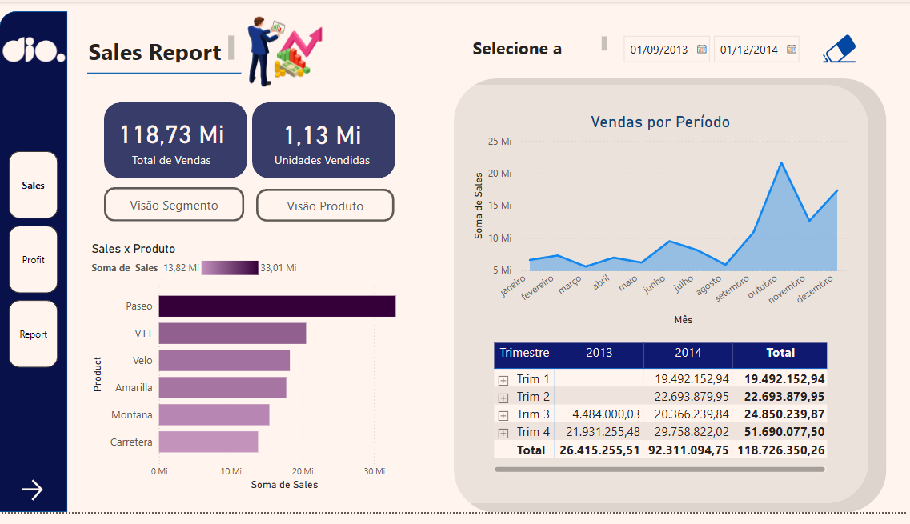
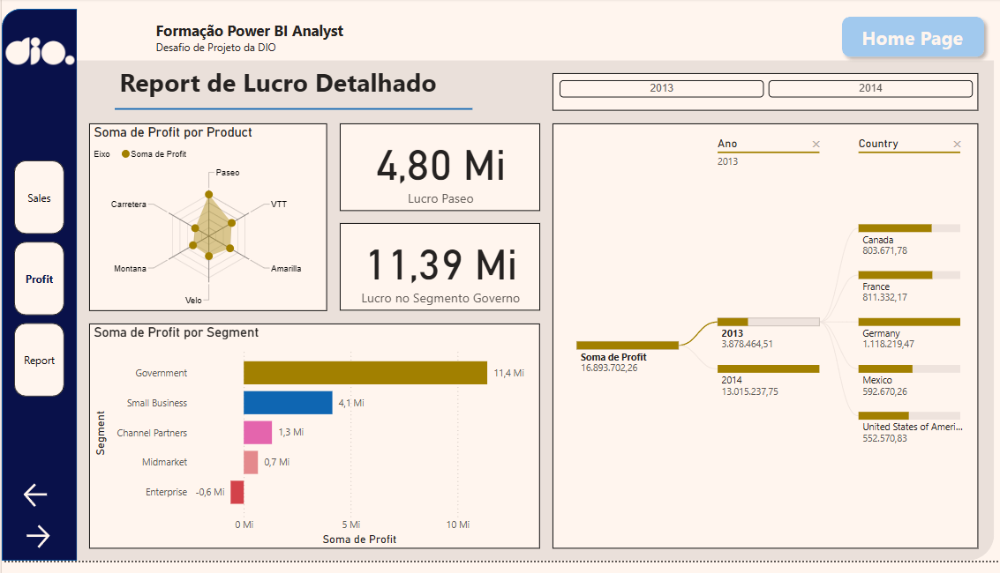

# Desafio DIO 
## Criando um Dashboard Gerencial para Tomada de Decisões Com Power BI

Nós realizamos as modificações no relatório conforme as instruções, tornando-o mais interessante e agradável aos olhos.
Modificamos somente as páginas 2 e 3 do relatório.

### Página 1
(Não alterada)

### Página 2
Antes:

Depois:

### Página 3:
Antes:

Depois:

### Alterações notáveis:
- Padronizamos o menu lateral
- Adicionamos alterações nos botões de navegação
- Trocamos o estilo de certos gráficos para melhor se adequarem aos objetivos propostos
- Destacamos certas informações relevantes para cada página do relatório 
